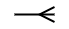

## Introducció

El __modelatge de les dades__ és una part fonamental en el disseny i la utilització
de les bases de dades. El modelatge ens ajuda a definir i a estructurar les dades
que es gestionaran. Dins del context de l'enginyeria de programari, aquesta
tasca es realitzarà en la fase de disseny.

En aquest cas, ens centrem en el modelatge de les dades en el __model conceptual__
de la base de dades.

## Model Entitat Relació

El __Model Entitat Relació (ER)__ és una tècnica de representació gràfica
d'un conjunt de dades i les relacions que existeixen entre elles. El model
ER va ser descrit per Peter Chen en 1976.

Les característiques principals d'aquest model són:

- Representar les dades i les relacions entre aquestes, no les seues transformacions.
- Inclou totes les dades del sistema, independentment de les utilitzades després per cada aplicació.
- És un model teòric, independent al SGBD o al sistema operatiu utilitzat.
- No contempla aspectes com l'espai utilitzat, emmagatzemament o el temps d'execució.

El model ER es basa en dos objectes: __Entitats__ i __Relacions__.

## Entitat
Una __entitat__ és qualsevol objecte o element (real o abstracte) que existeix i del qual es
dessitja emmagatzemar informació a la base de dades. Una entitat no és un objecte concret,
sinó una definició sobre la qual poden existir diferents objectes o __instàncies__.
En cada entitat es poden definir múltiples dades o característiques, anomenades __atributs__.

!!! example
    L'entitat __Cotxe__ té com a atributs el nom de la marca i el nom del model.

    <figure id="figure-1">
        
        <figcaption>Figura 1: Entitat COTXE amb atributs </figcaption>
    </figure>

    D'aquesta entitat podem tindre diferents objectes concrets, anomenades __instàncies o ocurrències__:

    - Cotxe `Marca` Seat i `Model` León.
    - Cotxe `Marca` Renault i `Model` Clio.

### Atributs
__Un atribut__ és una característica o
una propietat d'una entitat que ens interessa emmagatzemar. Els atributs
es representen en el diagrama amb un cercle connectat a l'entitat.

Els atributs de cada instància adoptaran uns valors concrets, que han de ser vàlids.
Es pot definir com __domini d'un atribut__ aquells valors que pot prendre un atribut.

- _Per exemple, un atribut numèric com l'edat no pot emmagatzemar caràcters alfabètics (lletres)_.

Si algun atribut pot no estar present, es diu que pot prendre el valor __nul__ (_null_ en anglés).

- *Per exemple, l'atribut __telèfon__ de l'entitat __Persona__ pot ser `null` si una persona en concret no té telèfon.*

Quan un atribut s'utilitza per identificar a una ocurrència d'una entitat, s'anomena que l'atribut
és una __clau primària__. Es representa subratllant el nom de l'atribut.

- *Per exemple, en l'entitat __Cotxe__, la matrícula podria ser la clau primària*.
- *Per exemple, en l'entitat __Persona__, el DNI podria ser la clau primària*.

### Entitats regulars
Les entitats es poden dividir en dos grups, les entitats __regulars o fortes__ i les entitats __febles__.

Les __entitats regulars, fortes o pròpies__ són aquelles entitats que s'identifiquen i
tenen existència per elles mateixes. Es representen per un rectangle i el seu nom és un substantiu.

<figure id="figure-2">
    
    <figcaption>Figura 2: Representació d'una entitat</figcaption>
</figure>

!!! example
    Les entitats __Cotxe__ i __Persona__ que estan relacionades
    entre si, i qualsevol de les dues té sentit i pot existir per ella mateixa.
    Es pot dir que les dues entitats són __entitats regulars o fortes__.

    <figure id="figure-3">
        
        <figcaption>Figura 3: Entitats Cotxe i Persona</figcaption>
    </figure>

### Entitats febles
Per contra, les __entitats febles__ són aquelles que sols poden ser identificades per estar associades a una altra entitat,
és a dir, que algun dels seus atributs que l'identifiquen es refereix a una altra entitat.
Es representen per un doble rectangle.

La relació que uneix una entitat feble amb la entitat forta de la que depén, s'anomena una __relació feble
o de dependència__ i s'indica amb un doble rombe.

El atribut o conjunt d'atributs que s'utilitzen per identificar una entitat feble s'anomenen __clau parcial o discriminant__.,
que permet diferenciar totes les ocurrències de l'entitat feble que depenen de la mateixa ocurrència de l'entitat
forta. S'indica amb un subratllat de punts.

<figure id="figure-4">
    
    <figcaption>Figura 4: Representació d'una entitat feble</figcaption>
</figure>

!!! example
    __Avió__ que és una entitat forta ja que pot existir per si mateix, i __Seient__,
    és una entitat feble ja que la seua existència depén de l'existència de l'avió on està situat el seient.

    L'avió s'identifica per un codi, el qual es la seua __clau primària__.
    En canvi, seien s'identifica per la seua relació amb avió. Per poder distingir entre
    els diferents seients de l'avió, s'utilitza el número de fila i la lletra del seient.
    Aquest conjunt d'atribut són els __discriminants o claus parcials__.

    <figure id="figure-5">
        
        <figcaption>Figura 5: Entitats Avió i Seient</figcaption>
    </figure>

## Relació
Una relació és una associació o una correspondència entre múltiples entitats i es representa mitjançant un rombe
amb un verb que descriu el tipus d'associació que es produeix.

<figure id="figure-6">
    
    <figcaption>Figura 6: Representació d'una relació entre entitats</figcaption>
</figure>

### Grau
El __grau d'una relació__ es defineix com el nombre d'entitats diferents que participen
en una relació. No existeix un límit en el nombre d'entitats que poden
participar en una relació.

#### Relació reflexiva
Si en una relació sols intervé una entitat, el grau de la relació és 1 i s'anomena __relació reflexiva__.

<figure id="figure-7">
    
    <figcaption>Figura 7: Representació d'una relació reflexiva</figcaption>
</figure>

!!! example
    Aquesta relació representa una __relació reflexiva__, una relació de grau 1 on una entitat està relacionada
    amb ella mateixa.

    <figure id="figure-8">
        
        <figcaption>Figura 8: Relació reflexiva entre empleats</figcaption>
    </figure>

    En aquesta relació es representa que un empleat pot estar subordinat a un altre empleat, i que un empleat
    pot tindre a múltiples altres empleats subordinats.

#### Relació binària
Si en una relació intervenen dues entitats, el grau de la relació és 2 i s'anomena __binària__.
Aquest tipus és el més comú de relació.

<figure id="figure-9">
    
    <figcaption>Figura 9: Representació d'una relació binària entre entitats</figcaption>
</figure>

#### Relació ternària
Si en una relació intervenen tres relacions, el grau de la relació és 3 i s'anomena __ternària__.

<figure id="figure-10">
    
    <figcaption>Figura 10: Representació d'una relació ternària entre entitats</figcaption>
</figure>

!!! example
    Aquesta __relació ternària__ representa les obres interpretades per una orquestra dirigides per un director.

    <figure id="figure-11">
        
        <figcaption>Figura 11: Relació ternària entre Orquestra, Director i Obra</figcaption>
    </figure>

### Cardinalitat
La __correspondència o cardinalitat__ es defineix com el nombre d'ocurrències o instàncies
de cada entitat que estan relacionades entre si. Les cardinalitats s'expresen com el número mínim
i màxim d'instàncies que intervenen en la relació.

| Cardinalitat | Definició | Símbol |
| :- | :- | :-: |
| __(1, 1)__ | Cada element de l'entitat li correspon un únic objecte de l'altra entitat __obligatòriament__. Es pot llegir com __1 i sols 1__. |   |
| __(0, 1)__ | Cada element de l'entitat li correspon un o zero objectes de l'altra entitat. Es pot llegir com __0 o 1__. |  |
| __(1, N)__ | Cada element de l'entitat li correspon un o més objectes de l'altra entitat __obligatòriament__. Es pot llegir com __1 o més__. |   |
| __(0, N)__ | Cada element de l'entitat li correspon zero o més objectes de l'altra entitat. Es pot llegir com __0 o més__. |  |

#### Exemple: (1,1) a (1,1)
!!! example
    Aquesta relació representa una relació d'1 a 1, és a dir, cada ocurrència d'una entitat es relaciona amb 1 i sols amb 1 ocurrència de l'altra entitat.

    <figure id="figure-12">
        
        <figcaption>Figura 12: Relació 1 a 1 entre Conductor i Permís de conducció</figcaption>
    </figure>

    Aquesta relació representa que un conductor té un permís de conducció obligatòriament, i que un permís de conducció ha de tindre un conductor associat obligatòriament.

#### Exemple: (1,1) a (0,1)
!!! example
    Aquesta relació representa una relació de 0 a 1, és a dir, cada ocurrència d'una entitat __pot estar relacionada__ amb 1 ocurrència de l'altra entitat, però
    pot __no estar-ho__.

    <figure id="figure-13">
        
        <figcaption>Figura 13: Relació 0 a 1 entre Persona i Permís de conducció</figcaption>
    </figure>

    Aquesta relació representa que una persona pot tindre un permís de conducció o no, i que un permís de conducció ha de tindre una persona associada obligatòriament.

#### Exemple: (1,1) a (0,N)
!!! example
    Aquesta relació representa una relació de 0 a N, és a dir, cada ocurrència d'una entitat __pot estar relacionada__ amb moltes ocurrències de l'altra entitat, però
    pot __no estar-ho__.

    <figure id="figure-14">
        
        <figcaption>Figura 14: Relació 0 a N entre Persona i Cotxe</figcaption>
    </figure>

    Aquesta relació representa que una persona pot tindre o no molts cotxes, i que cada cotxe ha d'estar associada a una persona.

#### Exemple: (1,N) a (0,N)
!!! example
    Aquesta relació representa una relació de N a N, és a dir, cada ocurrència d'una entitat __pot estar relacionada__ amb moltes ocurrències de l'altra entitat, i viceversa.

    <figure id="figure-15">
        
        <figcaption class="attribution">The Office</figcaption>
        <figcaption>Figura 15: Relació N a N entre Persona i Biblioteca</figcaption>
    </figure>

    Aquesta relació representa que una persona pot ser membre de múltiples biblioteques, però pot no ser-ho de cap. També representa que cada biblioteca
    té múltiples membres, però com a mínim en té 1.

#### Exemple ternària: (1, N) a (1, N) a (1, 1)
!!! example
    Aquesta __relació ternària__ representa les obres interpretades per una oruestra dirigides per un director.

    <figure id="figure-16">
        
        <figcaption>Figura 16: Relació ternària entre Orquestra, Director i Obra</figcaption>
    </figure>

    La cardinalitat s'interpreta de la següent manera:

    - Un director i una orquestra poden interpretar múltiples obres.
    - Un director pot dirigir una obra en múltiples orquestres.
    - Una orquestra interpreta una obra, dirigida per un únic director.

### Atributs d'interrelació
Les relacions entre diferents entitats també poden tindre característiques determinades, que poden
ser modelades mitjançant __atributs d'interrelació__.

<figure id="figure-17">
    
    <figcaption>Figura 17: Representació d'un atribut d'interrelació</figcaption>
</figure>

!!! example
    En aquest diagrama s'està modelant que una __Cistella de la compra__ conté múltiples __Productes__, però a més
    es té en compte quantes unitats de cada producte hi ha en cada cistella.

    <figure id="figure-18">
        
        <figcaption>Figura 18: Relació entre Cistella de la compra i Producte</figcaption>
    </figure>

### Entitat associativa
A més, en alguns casos una relació entre diverses entitats es pot considerar com una entitat diferent.
En aquests casos, parlem d'__entitats associatives__, que també poden contindre atributs.
Normalment apareixen en relacions __de molts a molts (N:N)__, on es necessita
que la relació ha d'estar relacionada amb una altra entitat.

<figure id="figure-19">
    
    <figcaption>Figura 19: Representació d'una entitat associativa</figcaption>
</figure>

!!! example
    Aquesta relació representa una associació entre diferents entitats mitjançant una
    __entitat associativa__, que està relacionada amb una tercera entitat.

    <figure id="figure-20">
        
        <figcaption>Figura 20: Relació entre Metge, Pacient i Prova</figcaption>
    </figure>

    En aquest diagrama s'està modelant que un __Pacient__ pot ser atés per diferents __Metges__. 
    A més, en aquesta consulta, el metge pot demanar diferents proves diagnòstiques.

## Generalització i especialització
La __generalització__ és el procés que permet combinar propietats comunes de diferents entitats
en una única entitat per evitar la redundància de dades.

En canvi, la __especialització__ és el procés de crear una nova entitat que herete
les característiques d'una altra entitat.

En els dos casos, en el diagrama ER es representa de la mateixa manera, amb un triangle invertit que connecta les classes generals amb les classes específiques.

<figure id="figure-21">
    
    <figcaption>Figura 21: Representació d'una generalització i especialització</figcaption>
</figure>

!!! example
    En el següent exemple tenim tres entitats, __Vehicle__,__Cotxe__ i __Moto__,
    que estan relacionades amb una relació d'especialització o generalització.

    __Cotxe__ i __Moto__ comparteixen els atributs de __Vehicle__,
    però també tenen atributs propis.

    <figure id="figure-22">
        
        <figcaption>Figura 22: Relació de generalització entre Vehicle, Cotxe i Moto</figcaption>
    </figure>

## Bibliografia
- Els diagrames s'han realitzat amb l'eina [draw.io](https://app.diagrams.net/)
- Material de Laura Villalba, _Introducció a les bases de dades_.
- Ahijado Sánchez, A, _Bases de datos_, Ed. Marcombo.
- https://vertabelo.com/blog/chen-erd-notation/
- https://stackoverflow.com/questions/38366466/when-to-use-associative-entities
- https://stackoverflow.com/questions/47150141/what-is-the-right-way-to-use-associative-entity
- https://stackoverflow.com/questions/18365870/er-diagram-ternary-relationship-how-to-read-properly

